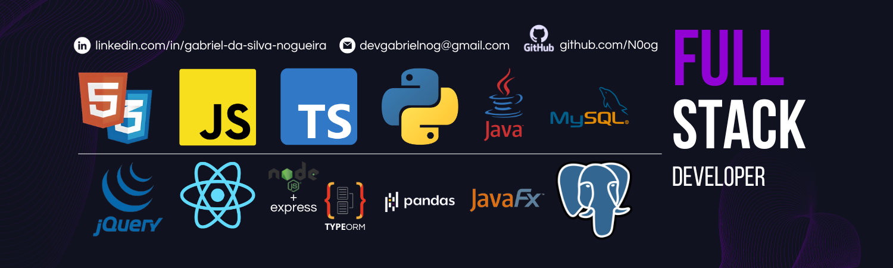

<h1 align="center"><b>Gabriel Nogueira - Desenvolvedor</b></h1>
Olá! 👋 Eu sou Gabriel, um entusiasta da tecnologia e um desenvolvedor FullStack determinado a transformar ideias em realidade digital.

## Sobre Mim

Como desenvolvedor FullStack, possuo uma sólida expertise em Front-End, Back-End e gerenciamento de bancos de dados. Estou constantemente explorando novas tecnologias e técnicas para aprimorar minhas habilidades e oferecer soluções inovadoras.

**Foco em Back-End:** Minha paixão pelo desenvolvimento reside na resolução de desafios complexos do back-end. Tenho grande afinidade em mergulhar na lógica dos sistemas e encontrar soluções eficientes para otimizar o desempenho e a eficácia.

**Mente Aberta, Coração Colaborativo:** Sou um defensor fervoroso da importância da colaboração e do aprendizado mútuo. Estou sempre em busca de contribuir com projetos, aprender com colegas e compartilhar minhas próprias experiências. Acredito que é através da colaboração que alcançamos os melhores resultados.

## Stack | Skills

<b>More...</b>

<h2>📌Fixed Repositories</h2>

<h2>GitHub Stats</h2>

## Boas Práticas 
Não defino meu nível de senioridade, mas me considero capacitado para lidar com questões desafiadoras e resolver problemas complexos de forma eficiente. Sempre busco seguir boas práticas e convenções de acordo com as tecnologias utilizadas.

## Colaboração e Aprendizado

Estou sempre aberto para colaborar em projetos, ajudar colegas e aprender com aqueles que têm mais experiência. Sou calmo e compreensivo, e valorizo a troca de ideias e a cooperação em equipe. Participo regularmente de reuniões e estou pronto para contribuir com opiniões e decisões quando necessário.

<h3>Sinta-se à vontade para entrar em contato comigo para colaborações, perguntas ou apenas para trocar ideias!</h3>
